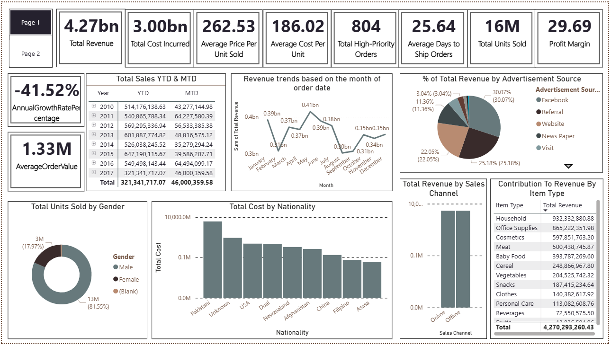

# Sales & Customer Insights Dashboard | Power BI

## Project Overview
Developed an interactive **Power BI dashboard** to analyze sales, revenue, and customer data, delivering actionable business insights. The dashboard includes YTD/MTD analysis, profit margins, revenue segmentation by region, gender, and sales channel, top-performing customers, and revenue forecasting.

## Key Features
- Total Revenue, Total Cost, Profit Margin, Units Sold, High-Priority Orders
- Revenue trends by month and annual growth rate
- Segmentation by customer nationality, gender, sales channel, and advertisement source
- Revenue contribution by item type and top customer analysis
- Forecasting and KPI tracking for decision-making

## Skills & Tools
- Power BI Desktop, DAX, Power Query
- Data Cleaning, Data Modeling, Data Visualization
- Trend Analysis, Forecasting, KPI Creation
- Excel / CSV Handling

## Screenshots

## File
- `Sales_Revenue_Analytics.pbix` – Power BI Desktop file
